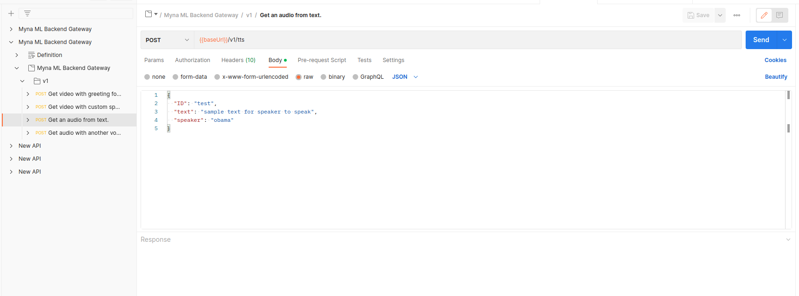

# Postman

- Download and install [https://www.postman.com/downloads/](https://www.postman.com/downloads/)
- Click: File→Import → Link → [https://gateway.neiro.ai/swagger/api.swagger.json](https://gateway.neiro.ai/swagger/api.swagger.json)
- Now you can interactively choose methods, send queries. The main difference with plain [Swagger ](./swagger.md) is that Postman is more interactive, than a website.

